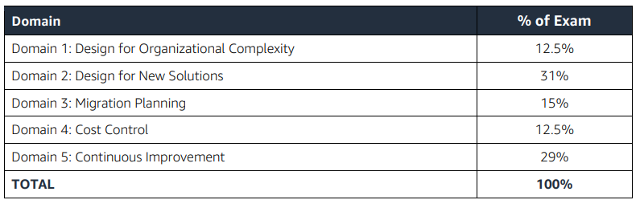

# aws-sa-profesional
## Scope Of the Exam DVA-C01

Free courses from AWS.

* EC2 Systems Manager: https://www.aws.training/learningobject/curriculum?id=13830
* Introduction to AWS Config https://www.aws.training/learningobject/video?id=16020
* Exam Readiness: AWS Certified DevOps Engineer – Professional https://www.aws.training/learningobject/wbc?id=19689

Testimoni

"So I just failed the CSA Pro 2019 exam and I'm taking another shot at it. One of the questions that stuck in my mind was about 3 VPCs peered together (B & C to A). VPC B and VPC C have overlapping CIDRs. I am pretty sure this is the exact image used from the exam - https://docs.aws.amazon.com/vpc/latest/peering/images/one-to-two-vpcs-lpm-diagram.png

(That image is from here, near the bottom - https://docs.aws.amazon.com/vpc/latest/peering/peering-configurations-partial-access.html)

So the situation involved only needing to route from VPC A to VPC B to get to the one instance, but still needing access to all of VPC C .

I totally guess at the answer, I think I picked an answer that mentioned a specific route for the instance in VPC B? I am not very strong in this area, if it isn't obvious. Even reading over the AWS documentation is just confusing to me. I think the documentation tells me that I picked the right answer since I only remember one answer mentioning a specific route for the instance in VPC B.

  
# HA and Fault Tollerant
	  

6. AWS Cheatsheets and Services Comparison by Tutorials Dojo

7. Udemy AWS SA Pro Practice Tests by Jon Bonso

Services/ difficult topics I encountered:

1. Lots of AWS Organizations scenario (Multi AWS accounts)

2. Difference between SCP vs IAM Policy

3. AWS Organizations which has multiple Organizational Units (OU)

4. All services within Systems Manager ( Automation, Run Command, Session Manager, State Manager, Patch Manager, Maintenance Window)

5. When to use AWS Serverless Application Model (SAM) vs CloudFormation in deploying Lambda with DynamoDB

6. Server Migration Service (SMS) + DMS + SCT - Can you migrate non-VM servers using SMS?

7. AWS Rekognition

8. AWS Mechanical Turk, AppStream?

9. AWS CI/CD Services (CodeCommit, CodeBuild, CodeDeploy, CodePipeline)

10. S3 Requester Pays

11. AWS Config and its integration with other services. Like managing "approved" AMI.

12. Managing S3 Bucket Permissions - Notify if there is a publicly accessible object in the bucket. Trusted Advisor vs AWS Config?

13. AWS WAF - applying rules for ELB, CloudFront, Amazon API Gateway and EC2

14. AWS Shield Advanced vs AWS Shield Standard

15. Amazon ES (Elasticsearch?) - Kibana

16. Providing access to data and visualization tool: QuickSight vs Kibana

17. Direct Connect, Direct Connect Gateway, VIFs and LAG

18. Lambda accessing a database from outside your VPC.

19. Transit VPC + Connecting hundreds of VPCs in your on-premise data center

20. A difficult scenario on VPC Peering when one VPC is peered with 2 VPCs which uses Longest Prefix Match.

21. Migration on-premise IBM MQ / WebSphere? Use Amazon MQ or EC2?

22. Private Hosted Zone in Route 53 to connect the routing of your multiple VPCs..

23. Lambda@edge when authenticating a website

24. Improving CloudFront performance (Cache Hit Rate?)

25. X-Ray vs Inspector vs Systems Manager

26. Athena, S3 Select, Glacier Select differences

27. Provisioned IOPS vs GP2,

28. DynamoDB Streams

29. AWS Batch,

30. AWS Directory Service

31. SWF vs Step Functions

32. Cached Volume vs Stored Volume vs File vs Tape Gateway

33. VPC Endpoint + Private vs Public VIF?

34. 6 Rs of migration: https://aws.amazon.com/blogs/enterprise-strategy/6-strategies-for-migrating-applications-to-the-cloud/

… I’ll add more if I can but those are the things I remember on the exam.

Helpful Links:

https://medium.com/@jonbonso/aws-certified-solutions-architect-professional-sap-c01-feb-2019-new-version-exam-notes-a2f557da4ed0

https://docs.aws.amazon.com/vpc/latest/peering/peering-configurations-partial-access.html#one-to-two-vpcs-lpm

https://aws.amazon.com/cloud-migration/

https://aws.amazon.com/premiumsupport/knowledge-center/iam-policy-service-control-policy/

Again, thank you everyone here who helped me. This forum gave me the necessary insights and tips that helped me aced the exam. This is my way of saying thank you and if you have any questions, just ask me here and I'll try to answer them! Don't forget to do your practice exams because that will really check your understanding of the topics.

There is no perfect reviewer out there so ensure that you read all of the explanations in each question in the practice exams, whether you are using ACG Exam Simulator or Udemy practice exams like Tutorials Dojo or other providers. Good luck on your upcoming exam!

Onwards to DevOps Pro!
